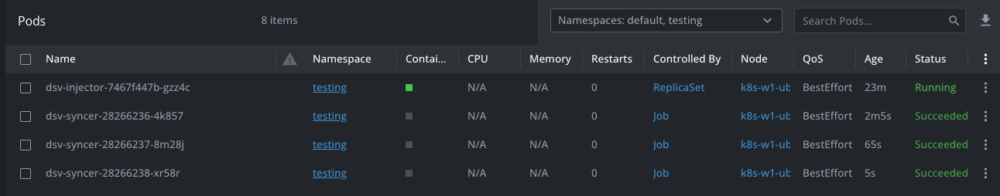
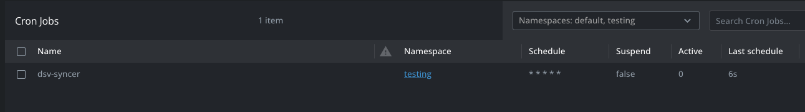
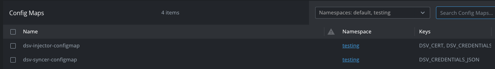
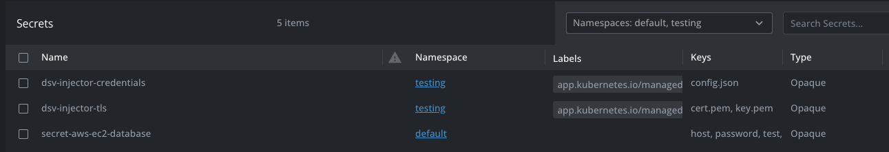
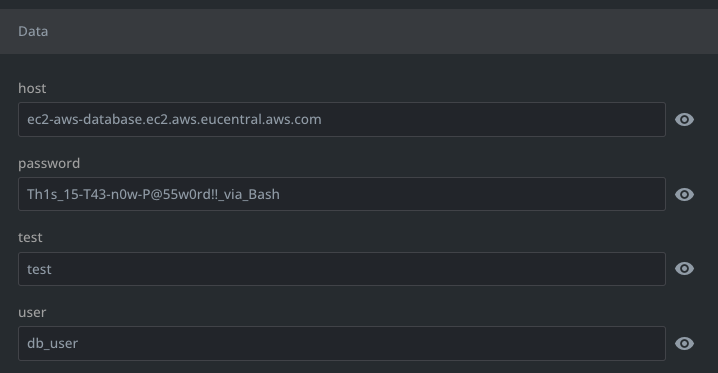

# dsv-k8s-arm
 ARM version of the two DSV parts (Injector and Syncer) for native K8s integration.

## Usage
To make the DSV Injector and DSV Syncher work some work has to be performed.


### Credentials for DSV
The file that holds the DSV credentials (Client_Id, Client_Secure_Id and tenant name) needs to be created. An example is shown below:

```json
{
  "default": {
    "credentials": {
    	"clientId": "<CLIENT_ID>",
	"clientSecret": "<CLIENT_SECRET_ID"
    },
    "tenant": "<TENANT>"
  }
}
```

### Manipulation of the DSV Injector and DSV Syncer
The below variables can be used to change the namespace, the json file that holds the credentials for DSV, what image to use and the version (IMAGE_TAG) of the image that needs to be pulled. The last variable is needed to start the two parts as the original container image is pointing to **/app/** to start the parts.

```bash
NAMESPACE='testing'
CREDENTIALS_JSON_FILE='dsv_creds.json'
IMAGE_REPOSITORY='docker.io/wessenstam/dsv'
IMAGE_TAG='latest'
IMAGE_ENTRYPOINT='/usr/bin/'
```

### Installation via Helm
For the installation Helm is being used. This is a pre-requisite to install the DVS K8s components.

#### Installing the Injector
Run the following command to install and run the DSV Injector. It will use the variables set earlier.
```bash
helm install --namespace $NAMESPACE --create-namespace --set-file credentialsJson=${CREDENTIALS_JSON_FILE} --set image.repository=${IMAGE_REPOSITORY} --set image.tag=${IMAGE_TAG} --set image.entrypoint=${IMAGE_ENTRYPOINT}'dsv-injector' dsv-injector ./charts/dsv-injector
```

#### Installing the DSV Syncer
After the installation of the DSV Injector and a successful running of the Pod, run the next helm command to install the DSV Injector:

```bash
helm install --namespace $NAMESPACE --create-namespace --set image.repository=${IMAGE_REPOSITORY} --set image.tag=${IMAGE_TAG} --set image.entrypoint=${IMAGE_ENTRYPOINT}'dsv-syncer' dsv-syncer ./charts/dsv-syncer
```
### Checking the installation
After the installation, the following will be available in k8s:

- **Pods**

    A pod named dsv-injector-xxxxxxxxx-xxxx will be seen and in a running state. Pods with the name dsv-syncer-xxxxxxxx-xxxxx with a state succeeded

    

- **Cron Job**

    A Cron Job will be added to k8s that is used for the dsv-syncer. This job will run every minute and syncs the data from DSV into k8s for defined secrets.

        

- **Config Maps**

    Two configmaps should be shown. They hold the information needed by the two components.

    


### Using the DSV integration
Now that the DSV integration is configured we need to create a kubernetes YAML file to start the synchronisation of the secret. The following YAML file can be used to pull/sync a secret called **aws:ec2-database**. The secret in k8s is named **secret-aws-ec2-database**:

```yaml
---
apiVersion: v1
kind: Secret
metadata:
  name: secret-aws-ec2-database
  annotations:
    dsv.delinea.com/credentials: default
    dsv.delinea.com/set-secret: aws:ec2-database
type: Opaque
data:
  host:
  password:
  user:
```

This will pull/sync the secret with respect to the field

- host
- password
- user

If the field in the YAML file does not exist, it will be delete from the secret. This way it is possible to avoid empty fields. Any fields that are now mentioned in the YAML file, will be added to the secret.

#### Checking the secret

After the secret has been defined using the YAML file, there will be a k8s secret named after the YAML file, besides two other secrets which are defined during the installation with Helm.



The data of the secret must match the secret from as available in DSV.



## Last information

### Screenshots
For the screenshots [Lens](https://k8slens.dev) is used as the k8s management tool.

### Original source
The information is put together using the files of Delinea DSV which can be found at https://github.com/DelineaXPM/dsv-k8s.

### Kubernetes
Information on Kubernetes can be found at https://kubernetes.io/docs/reference/generated/kubectl/kubectl-commands.